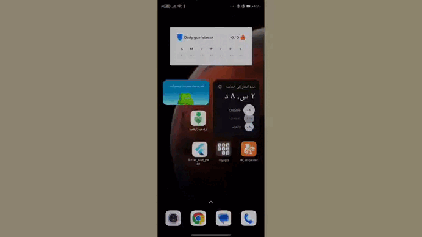

# Silly Jokes App 🎭
A single-page Flutter application that displays silly jokes. 

## Features ✨
- Displays pre-written jokes stored in a text file (**Jokes.txt**).
- Jokes are in Arabic and displayed randomly.
- Each joke appears only once per cycle, then the cycle resets randomly.
- After all jokes are displayed, the cycle resets, and jokes are shown randomly again.
- Beautiful and smooth design for a seamless user experience.
- Users can easily copy a joke by clicking on the dedicated copy icon.

## Future Enhancements 🔮
- Allow users to add favorite jokes to favorites list.
- Add animations to joke transitions.
- Allow users to add their own jokes.
- Provide sharing options for favorite jokes.

## Video

